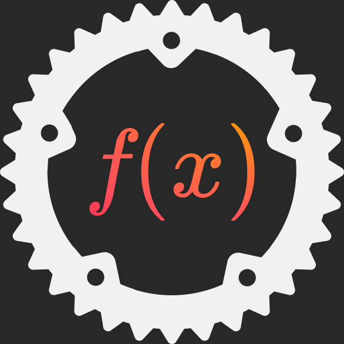

# fntools

 Weird tools for working with functions in rust <pre lang="rust">let fun = (|a, b| a + b)
&nbsp;   .chain(|x| (x % 2, x % 4))
&nbsp;   .chain(|t, f| (t, f)
&nbsp;        .also(|(t, f)| println!("{}, {}", t, f))
&nbsp;   );
&nbsp;
assert_eq!(fun(13, 10), (1, 3));
</pre>
  
## DISCLAIMER
This library more an fun experiment with rust, than really useful library.

However, in some cases it can make code a bit cleaner.
